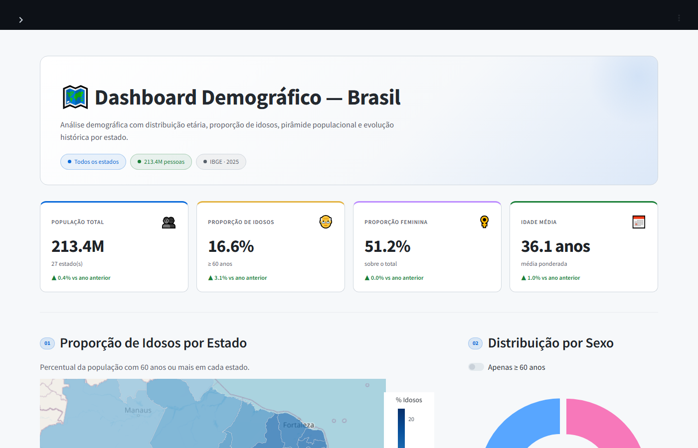

# Dashboard Demográfico — Brasil

Visualização interativa dos dados populacionais do IBGE por estado, com foco no envelhecimento populacional. A ideia surgiu da necessidade de entender de forma rápida como a distribuição etária varia entre os estados e como ela evoluiu de 2010 até 2025.



---

## O que você encontra aqui

- **Mapa coroplético** com a proporção de idosos (≥ 60 anos) por estado
- **Pirâmide etária** com faixas de 5 em 5 anos, separada por sexo
- **Distribuição por sexo** — geral ou apenas para a população idosa
- **Evolução histórica** da população de 2010 a 2025
- **Ranking dos estados** por proporção de idosos
- **KPIs com comparativo** ao ano anterior (população total, % idosos, % feminina, idade média)
- Tema claro e escuro com alternância em tempo real

---

## Stack

| Camada | Tecnologia |
|---|---|
| Interface | [Streamlit](https://streamlit.io) |
| Visualizações | [Plotly](https://plotly.com/python/) — `choropleth_mapbox`, `bar`, `pie`, `line` |
| Mapa | GeoJSON dos estados brasileiros + `px.choropleth_mapbox` |
| Dados | Parquet (IBGE) lidos com pandas, com cache via `@st.cache_data` |

---

## Estrutura

```
dashboard-demografico/
├── app.py                  # entrada principal — sidebar, filtros, layout
├── src/
│   ├── charts.py           # todas as figuras Plotly
│   ├── data.py             # carregamento e cache dos dados
│   ├── themes.py           # tokens de cor dark/light
│   └── utils.py            # helpers de formatação e componentes HTML
├── data/
│   ├── pop_ibge.parquet         # população por município, idade, sexo e ano
│   ├── ibge_municipios.parquet  # de-para município → UF
│   ├── ibge_ufs.parquet         # siglas dos estados
│   └── brazil-states.geojson   # geometria dos estados para o mapa
└── requirements.txt
```

---

## Como rodar

```bash
# clone o repositório
git clone github.com/Mcardosor/dashboard-demografico
cd dashboard-demografico

# instale as dependências
pip install -r requirements.txt

# suba o dashboard
streamlit run app.py
```

Acesse em `http://localhost:8501`.

> Python 3.10+ recomendado.

---

## Dados

Os dados populacionais vêm das **Projeções de População do IBGE** (2010–2025), granularidade por município, faixa etária e sexo. O pipeline de tratamento está fora deste repositório — os arquivos `.parquet` em `/data` já estão prontos para uso.

---

## Funcionalidades dos filtros

- **Ano de referência** — seleciona o ano base; todos os KPIs e gráficos se atualizam e exibem comparativo com o ano anterior automaticamente
- **Todos os estados** — quando desmarcado, abre seleção individual ou por região (Norte, Nordeste, Centro-Oeste, Sudeste, Sul)
- **Apenas ≥ 60 anos** — toggle no gráfico de distribuição por sexo para focar na população idosa
