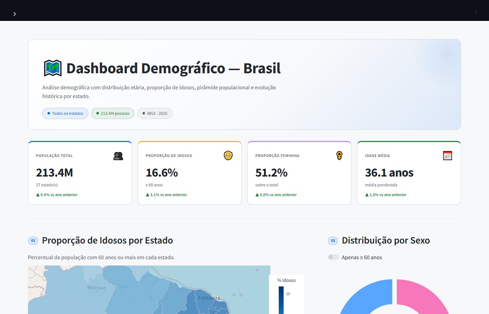

# Dashboard Demográfico — Brasil

Visualização da distribuição etária da população brasileira por estado, com foco no envelhecimento populacional (2010–2025), a partir das Projeções de População do IBGE.



Acesso: http://164.41.147.175:8501/cenarios/demografico

## Conteúdo

- Mapa coroplético com proporção de idosos (≥ 60 anos) por estado
- Pirâmide etária em faixas de 5 anos, por sexo
- Distribuição por sexo, geral ou só na população idosa
- Evolução histórica da população, 2010–2025
- Ranking dos estados por proporção de idosos
- KPIs com comparativo ao ano anterior (população total, % idosos, % feminina, idade média)
- Tema claro e escuro

## Filtros

- Ano de referência — atualiza KPIs e gráficos, com comparativo automático ao ano anterior
- Seleção de estados — individual ou por região (Norte, Nordeste, Centro-Oeste, Sudeste, Sul)
- Toggle "apenas ≥ 60 anos" no gráfico de distribuição por sexo

## Stack

| Camada | Tecnologia |
|---|---|
| Interface | Streamlit |
| Visualizações | Plotly (`choropleth_mapbox`, `bar`, `pie`, `line`) |
| Mapa | GeoJSON dos estados + `px.choropleth_mapbox` |
| Dados | Parquet (IBGE), pandas, cache via `@st.cache_data` |

## Como rodar

```bash
git clone https://github.com/Mcardosor/dashboard-demografico
cd dashboard-demografico
pip install -r requirements.txt
streamlit run app.py
```

Acesse em `http://localhost:8501`. Python 3.10+.

## Dados

Projeções de População do IBGE (2010–2025), por município, faixa etária e sexo. O pipeline de tratamento não está neste repositório — os `.parquet` em `/data` já vêm prontos para uso.

## Estrutura

```
dashboard-demografico/
├── app.py                  # entrada principal — sidebar, filtros, layout
├── src/
│   ├── charts.py           # figuras Plotly
│   ├── data.py              # carregamento e cache
│   ├── themes.py            # tokens de cor dark/light
│   └── utils.py             # formatação e componentes HTML
├── data/
│   ├── pop_ibge.parquet
│   ├── ibge_municipios.parquet
│   ├── ibge_ufs.parquet
│   └── brazil-states.geojson
└── requirements.txt
```
